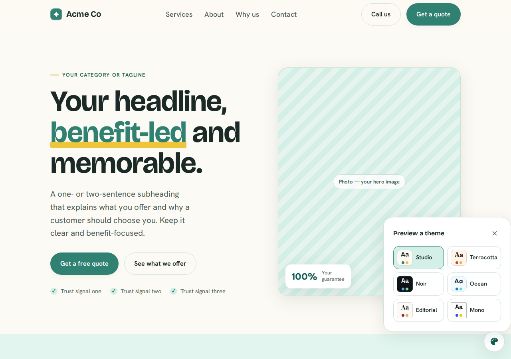
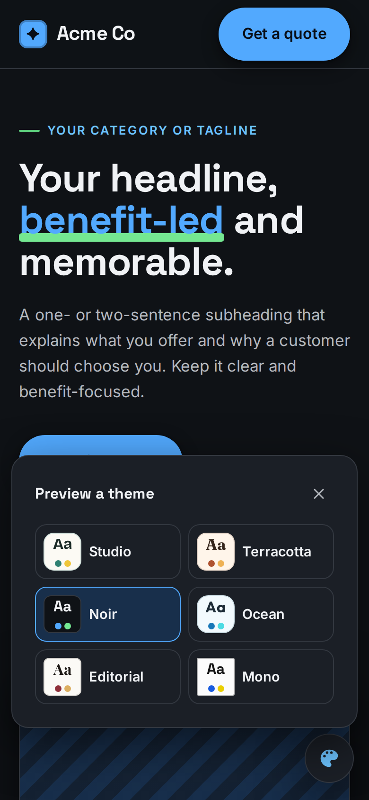
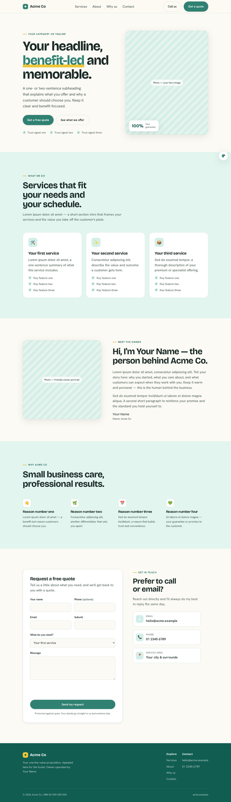
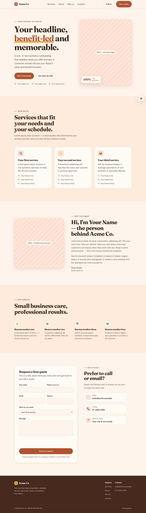
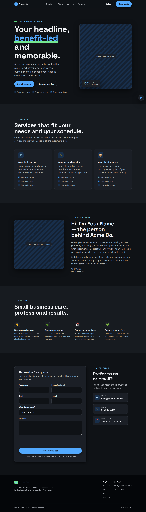
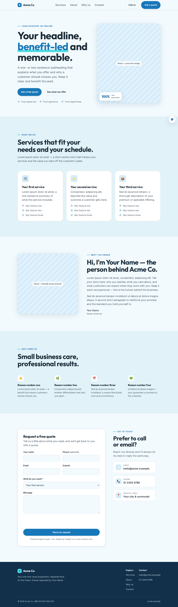
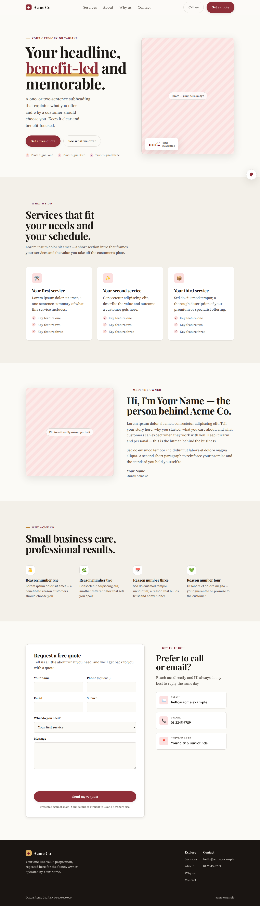
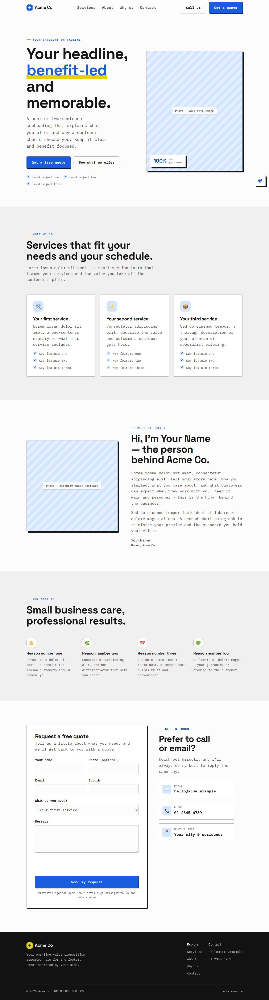

# Theme switcher — preview gallery

Proof that the floating theme switcher re-skins the whole page (palette + typography +
shape) live. Each theme is a `[data-theme]` block in `src/styles/themes.css`; the choice is
saved to `localStorage` (no cookies) and re-applied before paint. Screenshots are generated
from the real running site.

## The switcher

| Desktop popover | Mobile bottom sheet |
| :-- | :-- |
|  |  |

Each swatch renders in its **own** theme (note Editorial's serif "Aa", Mono's grotesk) via a
nested `data-theme` — no colours are duplicated in JS.

## Themes

### Studio (default)

### Terracotta — warm earthy serif

### Noir — dark, high-contrast

### Ocean — cool blue, airy

### Editorial — classic magazine serif

### Mono — brutalist / technical

